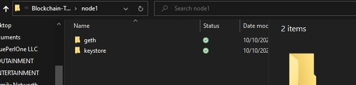

# Implementation Proof of Authority Blockchain
Implementation of TestNet Proof of Authority Blockchain for a Bank

## Outline

Here we have created a testnet blockchain network with Proof of Authority (POA) consensus. Then we have used it to process 3 transactions succesfully.

## Part 1 - Custom testnet POA Etherium blockchain setup

a. Install the **MyCrypto desktop app** [https://download.mycrypto.com/](https://download.mycrypto.com/). Please follow the directions appropriately. The app enables direct interaction with the blockchain. Our transactions will be mediated by this app and the subsequent verification on each wallet holding sent/recieved funds will be provided by the app. 

b. Download the zip folder for **Go Ethereum tools** [https://geth.ethereum.org/downloads/](https://geth.ethereum.org/downloads/) where the required stabel release version is "Geth & Tools 1.9.7". Please follow the directions appropriately. 

c. Within the Git cloned "Implementation_Proof_of_Authority_Blockchain" folder (or any named folder of your choosing for this implementation) create a "Blockchain-Tools" folder and copy the 9 files from the above "Geth & Tools 1.9.7" zip folder.

d. Open a GitBash/teminal window and navigate to "Blockchain-Tools" folder within the "Implementation_Proof_of_Authority_Blockchain".

e. Type and enter the following commans 

./geth --datadir node1 account new

./geth --datadir node2 account new

Run puppeth, *"waternet"* (or name your own network), and select the option to configure a new genesis block.

Choose the Clique (Proof of Authority) consensus algorithm.

Paste both account addresses from the first step one at a time into the list of accounts to seal.

Paste the first account again in the list of accounts to pre-fund. There are no block rewards in PoA, so you'll need to pre-fund.

You can choose *no* for pre-funding the pre-compiled accounts (0x1 .. 0xff) with wei. This keeps the genesis cleaner.

Be sure to give a fresh (never used) chain/Network ID number when requested.

Complete the rest of the prompts, and when you are back at the main menu, choose the "Manage existing genesis" option.

Export genesis configurations. This will fail to create two of the files, but you only need *waternet.json* (or your network name.json).

Once the genesis block creation completed, it is possible to initialize the nodes with the genesis *waternet.json* file.

Using geth, initialize each node with the new networkname.json.

./geth --datadir node1 init waternet/waternet.json

./geth --datadir node2 init waternet/waternet.json

Node1 & Node2 folder settings once completed:

## Part 2 - Setting up mining and begin the node1 and node2

Next initialize mining blocks on the nodes.

Run the nodes in separate terminal windows with the commands:

./geth --datadir node1 --unlock "SEALER_ONE_ADDRESS with out initial ox digits of the address and quotations" --mine --rpc --allow-insecure-unlock

Copy the *"enode://"* address from the node1 mining output and use it below to set the mining in the node2.

./geth --datadir node2 --unlock "SEALER_TWO_ADDRESS with out initial ox digits of the address and quotations" --mine --port 30304 --bootnodes "enode://SEALER_ONE_ENODE_ADDRESS@127.0.0.1:30303" --ipcdisable --allow-insecure-unlock

**NOTE:** Type your password and hit enter - even if you can't see it visually!

When needs to terminate the mining use *Ctrl/Command + C* at each of node1 and node2 mining *GitBash/Terminal*.

Open up MyCrypto, unlock the wallet using your keystore file from node1.  

## Part 3 - Processing a Ethereum transaction from one node to another 

Next connect MyCrypto with the blockchain you created. 

Open up MyCrypto, then click Change Network at the bottom left
Click "Add Custom Node", then add the custom network (by schrolling down) information that you set in the genesis. (waternet, chain ID: 340, http://127.0.0.1:8545 -since this is local newtwork it does not need https://)

Once you save and use the network, double-check that it is selected and is connected.

Then select the keystore file from *"keystore"* folder within the *"node1"* folder in *"blockchain-Tools"* folder. 

Give the password if the node1 is password protected if you set as such in creating the node1.

Once the wallet is setup it is possible to observe the vallet, the address, and the mined test ETH.

Send a transaction from Node 1 to Node 2 to test out the connection

Copy the pre-fund address of Node 2 (from the address of Node 2) into the "To Address" field, then fill in an arbitrary amount of ETH

Confirm the transaction by clicking "Send Transaction", and the "Send" button in the pop-up window.

Follwing shows the outputs on MyCrypto:

We have performed 3 transactions from Node1 to Node 2:

    Transaction 1. value = 100000 test ETH
    Transaction 2. value = 50000 test ETH
    Transaction 3. value = 500000 test ETH

Verification once signed (using keystore file of Node 2) on to Node 2 in Mycrypto is as follows:

This concludes the test implementation.
